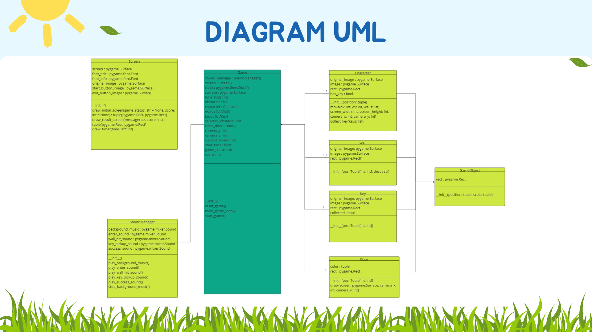

# Telusur

## 📖Daftar Isi

- [Deskripsi Game](#deskripsi-game)

- [Libraries](#libraries)

- [Cara Bermain](#cara-bermain)

- [UML Class Diagram](#uml-class-diagram)

- [Kontribusi](#kontributor)

- [Referensi](#referensi)

- [Kontak](#kontak)

## 🎮Deskripsi Game

Game ini diberi nama “TELUSUR” , merupakan sebuah permainan yang mengambil inspirasi dari kata "telusur" dalam bahasa Indonesia, yang berarti menjelajahi. Konsep game ini didasarkan pada tema permainan labirin, di mana player harus menjelajahi berbagai jalur yang rumit, berliku-liku, dan penuh jalan buntu. Game ini direpresentasikan dalam bentuk format 2 dimensi. Dalam game ini, player dilatih untuk mengandalkan ingatan dan berpacu dengan waktu.

## 📚Libraries

- [Python 3.11](https://www.python.org/)
- [Pygame](https://www.pygame.org/)

## 🎮Cara Bermain

Berikut cara bermain game ini:

1. Gunakan panah kanan (→) untuk player berjalan ke arah kanan
2. Gunakan panah kiri (←) untuk player bergerak ke arah kiri
3. Gunakan panah atas (↑) untuk player berjalan ke arah atas
4. Gunakan panah bawah (↓) untuk player berjalan ke arah bawah

Pada awal permainan, player akan diberikan waktu sepuluh detik untuk melihat sebuah peta. Mereka harus mengingat semua detail dari peta tersebut, termasuk lokasi kunci dan jalan keluar dari labirin. Setelah hitungan mundur selesai, mereka akan langsung terjun ke dalam labirin dan memulai petualangan mereka.

Ketika player sudah masuk ke dalam labirin, player hanya dapat melihat sebagian kecil dari keseluruhan labirin, yang membuat mereka tidak dapat melihat seluruh peta jalur sekaligus. Di sinilah keterampilan player dalam mengingat kembali peta labirin yang telah ditampilkan di awal permainan menjadi krusial untuk menyelesaikan permainan tersebut.

Player diberikan batas waktu tiga menit untuk menemukan jalan keluar dari labirin, namun sebelum itu mereka harus mencari dan
mengambil kunci terlebih dahulu sebagai syarat keluar dari labirin. Jika waktu berakhir dan player belum berhasil menyelesaikan labirin, mereka akan langsung kembali ke menu utama permainan.

## 📖UML Class Diagram

## 👨🏽‍💻Kontributor

| Nama                    | NIM       | Peran |
| ----------------------- | --------- | ----- |
| Ridho Lailatul Akbar    | 122140136 | Programmer     |
| Apridian Saputra        | 122140143 | Programmer     |
| Shintya Ayu Wardani     | 122140138 | Design Assets     |
| Keti Azura              | 122140139 | Design Assets     |
| Rustian Afencius Marbun | 122140155 | Programmer     |
| Robby Bangsawan         | 120140190 | Programmer     |
